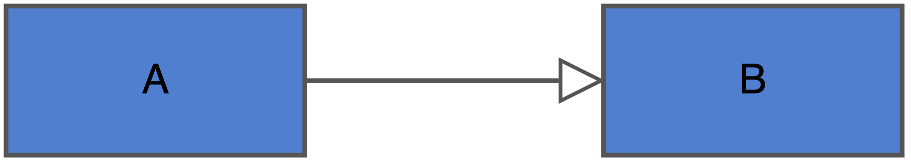
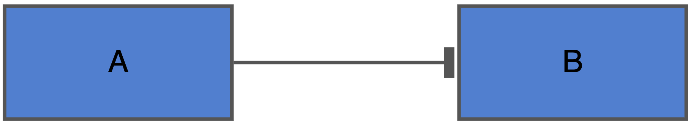
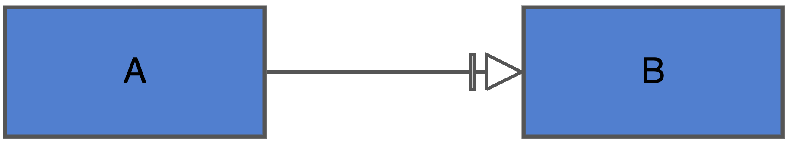
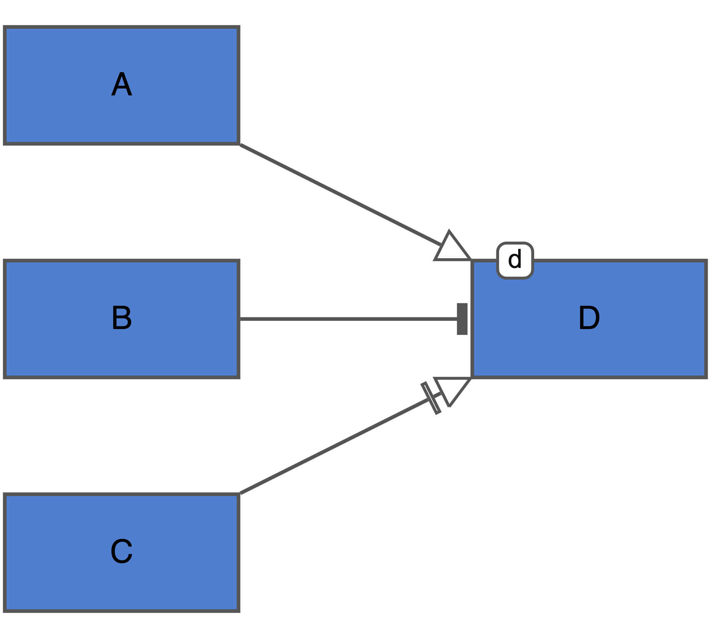
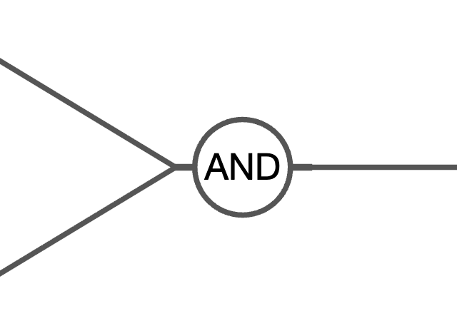

# Algebraic Rules

## Default algorithmic rule set

There are several types of information that can contribute to the
building of an equation. These types of information will be considered
in a particular order to build an equation acording to the algorithmic
rules. See the first Table for the different components that can
contribute, as well as the order in which they are considered when
building an equation. Equations do not necessarily need to include every
one of these components. An example of how incoming edge types can be
used to generate a difference equation can be seen in Figure 1.

*Table 1: The types of building blocks used to generate the equation
representing a node.*

| Order of consideration | Equation building block | Representation in equation |
|----|----|----|
| 1 | Stimulant | As an average of the summed stimulants |
| 2 | Inhibitor | The number of inhibitors plus 1, divided by the sum of inhibitors plus 1 |
| 3 | Necessary stimulant | A function of the necessary stimulant multiplied against the above influences |
| 4 | Modifier | Multiplication against above influences |

*Table 2: An example of the diagramatic representation of different
edges and their resulting mathematical representation.*

| SBGN-AF syntax | Algorithmic rule |
|----|----|
|  | $`B[t] = A[t-1]`$ |
|  | $`B[t] = \frac{2}{1 + A[t-1]}`$ |
|  | $`B[t] = 1 \times f(A[t-1])`$ |
|  | $`D[t] = \frac{2 \times A[t-1]}{1 + B[t-1]} \times f(C[t-1])*d`$ |

As a supplement to the above building blocks, it is possible to combine
upstream nodes in the case that their influence only occurs when in
combination with each other. An example of this could be an enzyme
needing to interact with a substrate to produce a product.

*Table 3: Additional operator used to modify how incoming nodes affect
the node of interest. The following equation dictates how these incoming
nodes are treated, the final value of which is treated as a single input
for the respective builing block that the interaction belongs in.*

| SBGN-AF syntax | Algorithmic rule |
|----|----|
|  | $`AND[t]=^r\sqrt{\prod\limits_{i=1}^{r}Node_i[t]}`$ |

### Example network and its conversion

Here is an example of a diagram showing a simplified diagram of the
branching network in plants.


Figure 1. Simple branching network.

Using the above algorithmic rules, this diagram would be translated into
the following set of equations.

``` math
\begin{gather}
    Auxin[t+1]=Aux \label{eq3}\\
    Strigolactone[t+1]=Auxin[t]\times SL \\
    Sucrose[t+1]=Suc \\
    Cytokinin[t+1]=Sucrose[t]\times\frac{2}{1+Auxin[t]}\times CK \\
    Integrator[t+1] = Strigolactone[t]\times\frac{2}{1+Sucrose[t]} \\
    Branching[t+1]=Cytokinin[t]\times\frac{2}{1+Integrator[t]}
    \label{eq8}
\end{gather}
```

The above example does not include necessary stimulants, AND, or any
exogenous supplies.

### Modifications to the functional forms of necessary stimulants

The influence of a necessary stimulant is defined by the user, which is
applied as some function of the necessary stimulant (`f(necStim)`). The
default function is simply linear. In this case, a necessary stimulant
will behave in the same was as a modifier. Users can choose to instead
use a form that is either step-like, or based on Michaelis-Menten
dynamics.


Figure 1. A depiction on how different forms for necessary stimulants
can effect their downstream impact.

Note that in all cases, when the value of the necessary stimulant is 1,
the chosen form has no effect. Changing the functional form of a
necessary stimulant has the greatest impact at low values for the
necessary stimulant. The biological interpretation of the step-like
functional form for example is that even a tiny supply of the necessary
stimulant is required to induce a rapid response in the system.

Like a modifier, the necessary stimulant term will be multiplied against
the other terms in the equations.

### Adding an exogenous supply

One more term that can be added to equations is that of an exogenous
supply. The exogenous supply term is the only one that does not have a
direct representation in the SBGN diagram. Instead, you can indicate
when you use the `buildModel` function if you want the equations to
include an exogenous term by supplying the argument `exogenous = TRUE`.
This is the default argument for the equation as it allows the most
flexibility down the line. This argument can be changed to FALSE if you
decide that you do not want to use an exogenous supply, and would rather
have simpler looking equations.

The exogenous supply behaves as a static addition term in the equation.
Whatever supply that you have chosen to provide, will be a final
addition to the equation.
