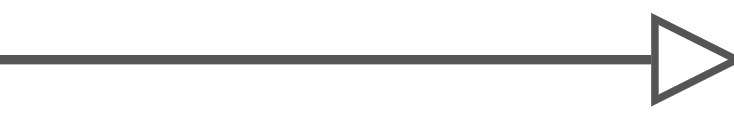
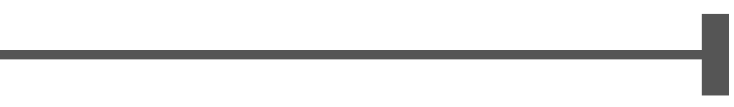
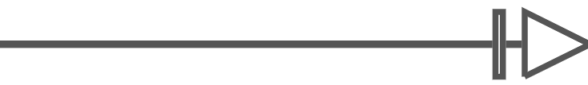
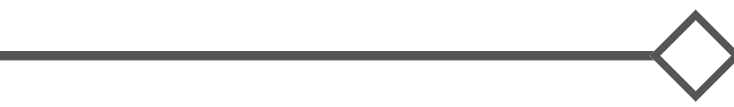
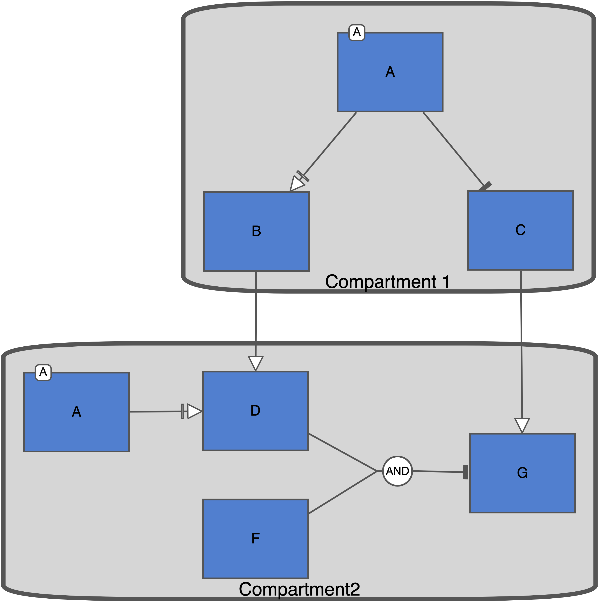

```{r, include = FALSE}
knitr::opts_chunk$set(
  collapse = TRUE,
  comment = "#>"
)
```

### What is prior knowledge? {#hypotheses}

#### Tips for hypothesis organisation

### Language for model construction

#### Model language: Nodes and Edges

Nodes and edges represent our beliefs regarding how plants integrate information to make decisions. Nodes represent a kind of information used by the plant to make developmental decisions. This can include internal hormones, or externally sourced inputs such as light, or nitrogen. Each node type will be expressed as a value relative to some baseline 1. Often, this baseline will represent the wild-type of a plant under ideal environmental conditions.

Edges represent the directionality of influence, as well as the influence type between nodes. Edges describe how the plant uses the information contained in nodes to make decisions. 

Nodes will be represented by nouns as they represent something that the plant can use as a signal. Edges will be represented by verbs as they describe the influence of a node on downstream nodes.

#### Model language: Modifiers

Modifiers act to scale the value of specific nodes in the network. They can represent critical genetic instructions that are necessary for the functioning of their specific node. Modifiers are given a value by the user and act by describing the level of expression of a node relative to baseline (1). The value of the modifier will be multiplied against the value of the node as determined by any other system inputs. Therefore, a modifier value of 0 will have the function of removing the node from the network irrespective of the other inputs being received by said node.

In the context of the model, modifiers behave as parameters which define the conditions under which a simulation is occurring. They can be considered the inputs of the model. The values of modifiers remain static over the course of the simulation. In contrast, nodes behave as variables. The values of nodes are expected to change over the course of the simulation. Once the simulation reaches a stable state (node values are unchanging), the values of nodes will be taken as the output of the simulation. The network topology in this case is the model being tested.

#### Model language: Compartments

Compartments are useful in that they can help define locations of influence in the network. They have very little influence on the progression of a simulation as they do not change the behaviour of either nodes or edges. However, they are useful when there are multiple sources of production for a node, and for allowing the differential expression of modifiers within different locations of the system. For example, the hormone Strigolactone is produced in both the root and shoot of the plant. By creating root and shoot compartments, a Strigolactone node can be defined in both the compartments without otherwise being distinguished from each other. PSoup will automatically treat the two nodes as separate entities while maintaining clarity for the user. Compartments also facilitate the case when modifiers are differentially expressed in different locations of a biological system. If a modifier is attached to nodes in different compartments, the user will be able to specify different values for each compartment. This is useful, for example, in the case that the user is trying to replicate the conditions of a grafting experiment where a gene is knocked out in one location but not in the other.

#### SBGN terminology

SBGN is a set of standardised graphical languages used to describe biological systems. The description of hypotheses has been restricted to the use of terminology that maps directly onto the SBGN Activity Flow language.

There are many different mechanisms by which a biological system regulates itself. However, here the focus must be limited to whether the influence between nodes is either positive or negative in terms of the outcome of the downstream node. 

Type of edge | SBGN-AF equivalent language | Symbol
---          | ---                         | ---
Stimulation | Positive influence | {width=50%}
Inhibition | Negative influence | {width=50%}
Necessary stimulation | Necessary stimulation | {width=50%}
Unknown | Unknown | {width=50%}

Operator | Placement | Symbol
--- | --- | --- 
and | Linking two origin nodes with a single destination node. | {width=10%}
<span style="color:blue;">or</span> | <span style="color:blue;">Linking two origin nodes with a single destination node.</span> | {width=10%}
delay | Link one origin node to one destination node. | {width=10%}

<span style="color:blue;">
OR has not been encoded yet as I am unsure if it is biologically relevant. Please let me know if this is a feature that would be useful to you. As I imagine it now, I believe that the OR operator would be useful in two different scenarios, as either an inclusive or exclusive or. In either case, it would only be used to connect a series of incoming nodes to a single downstream node. It would never be used to connect a single upstream node to multiple downstream nodes.
</span>

<span style="color:blue;">
Inclusive OR: This would describe the case that at least one of the upstream nodes is enough to cause the downstream effect. In such a case, the value of the influence will take on that of the node with the maximum value.
</span>

<span style="color:blue;">
Exclusive OR: This would describe the case that only one of the upstream nodes can be present for the downstream effect to take place. It will not occur if both upstream nodes are present. I am not sure if this is biologically realistic. If you have a case that an exclusive OR could be applicable to, tell me about it so that I can think of the best way to encode such a scenario.
</span>

### Syntax guide

Hypotheses (MOH), and the Edge Oriented Hypotheses (EOH). In either case, the modifier or edge will be contextualised by nodes. In the MOH, a modifier is being attached to a node which will allow the modifier to weight the strength of action of the node. A MOH will always be found in the following form:

<center>The \<modifier> modifier is necessary to produce \<node>.</center>

Modifiers must always be indicated as modifiers, otherwise they can be assumed to be nodes. The same modifier can be attached to multiple nodes. MOHs will never contain edge information.

EOHs express the direction and type of influence between nodes and will never contain modifier information. They will always take the following form:

<center>\<origin node> \<edge type> \<destination node>.</center>

The EOH has some additional flexibility built in as they can make use of logical operators. Combinations of nodes can be specified by making use of the AND operator as a separator to list all the relevant nodes. If you use the AND operator, you are indicating that all the specified nodes must be present for an action to occur. <span style="color:blue;">You can possibly use the OR operator to specify if any of a list of origin nodes can cause an influence to occur. There may be some nuance regarding inclusive vs exclusive OR. OR should never be used to list destination nodes.</span>

Compartmentalising nodes in the network can be good for two reasons. The first is to visually assist in understanding where different loci of influence exist in the system. The second is to allow for the possibility of differential expression of modifiers in the case that the same modulator has been assigned to nodes existing in different compartments. This is useful when modelling plant development under different grafting conditions. Grafting involves attaching the rootstock of one plant, to the scion (shoot) of another plant. This allows for the differential expression of the same gene within different locations in a plant. Compartmental information can be provided by adding ‘in the \<location>’ to the end of either the MOH or EOH. Example statements can be seen in Table 4.

Below is a list of considerations that should be kept in mind when constructing hypotheses and diagrams:

1. Each interaction should be represented only once.
2. Nodes must share an edge with at least one other node.
3. Each interaction that will be included in the model/diagram should be included in the list of hypotheses.
4. Interactions should be specified only between neighbouring nodes (no summary interactions should be stated, overall effects should be deduced from the combination of intermediary interactions).
    a. Any summarising statements are likely to be mistakenly interpreted as an alternate route of action.
5. Independent inputs should be distinguished from non-independent inputs. Non-independent inputs can be indicated using the word AND to list all the interacting inputs.
6. Modifiers should be distinguished from nodes.
7. Modifiers should be connected to all the nodes on which they act (a single modifier can be attached to multiple nodes).
    a. If a ‘modifier’ itself has inputs in the system (e.g. if the expression of a modifier can itself be regulated by other nodes), that ‘modifier’ should be expressed as a node with an attached modifier. The node and attached modifier can be given the same name to communicate what you are doing. This node will have a necessarily stimulatory relationship with all nodes for which said modifier is essential. This is useful in instances where the expression of a gene is regulated by the network.
8. Statements should be simplified as much as possible to the effect of whether levels of the influenced node are expected to go up or down (are stimulatory or inhibitory).
9. <span style="color:blue;">It might be necessary to infer an ‘integrator’ or ‘intermediate’ node to correctly represent what is going on. This decision can be left to the modeller, who will choose the best representation given the context of the full network (this of course should be confirmed later with the biologist).
    a. A consequence of the modeller deciding that there needs to be an intermediary node, will be the creation of a new statement describing a stimulatory relationship between the originating and intermediary node.</span>
10. If there are multiple sources for the contents of a node, they should be distinguished from each other by placing the different representations of the node in different compartments.
11. There must not be any nodes existing outside of a compartment.
12. A record of supporting evidence behind each node should be kept for reference. This will help restrain the network to highly supported interactions (at least initially). In addition, it will make it easier to interrogate the network in the case that the model is not validated against biological data.

### Example statements

No. | Hypothesis 
--- | ---
1	| The a modifier is required to produce A in compartments 1 and 2
2	| A stimulates B in compartment 1
3	| A inhibits C in compartment 1
4	| A stimulates D in compartment 2
5	| D AND E inhibits F in compartment 2
6	| The f modifier is required to produce F in compartment 2
7	| B in compartment 1 necessarily stimulates D in compartment 2
8	| C in compartment 1 stimulates F in compartment 2

<center>
```{r, echo=FALSE, out.width="80%", fig.cap="Figure 1. An example network diagram built based on the above example hypothesis statements."}

```
</center>


