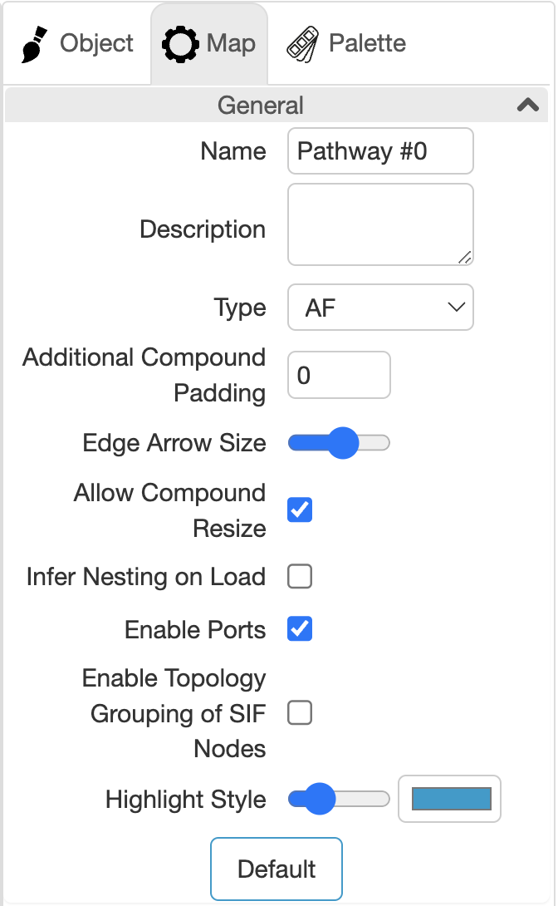
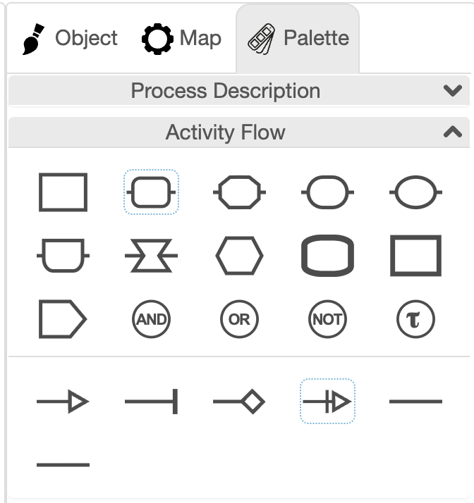
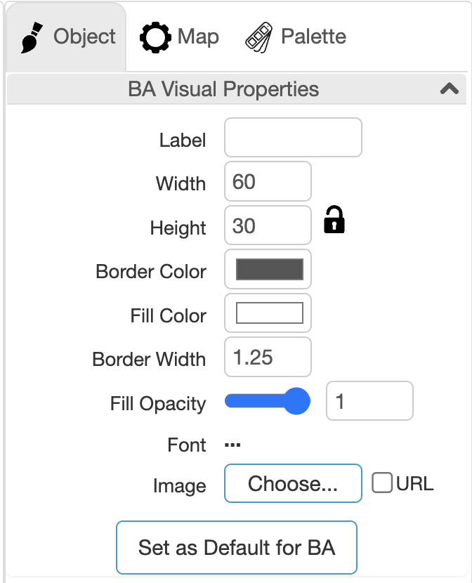
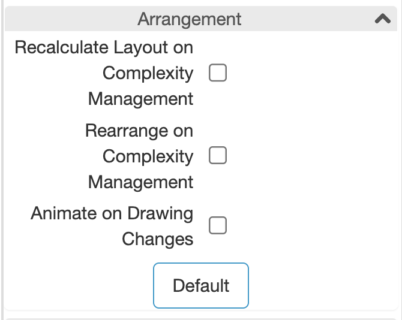
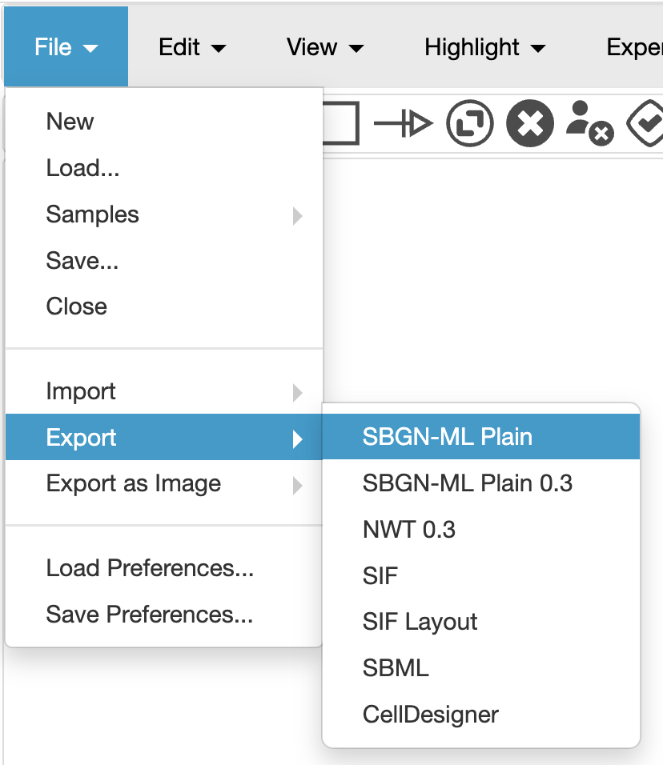

```{r, include = FALSE}
knitr::opts_chunk$set(
  collapse = TRUE,
  comment = "#>"
)
```

### Building a diagram using the Newt editor

Once a set of hypotheses have been constructed, they can used to generate a diagram to be given to PSoup. Diagrams must be constructed using the SBGN-AF language to be readable by PSoup. [newteditor.org](https://newteditor.org/) is a good tool to construct such a diagram as it is easy to use and entirely online. For a detailed guide on how to use the Newt editor, see their tutorials page ([Newt tutorials](https://newteditor.org/tutorials.html)). This section will give you the essentials. Once on the newt editor page, click the Launch newt button to gain access to the display.

The first thing to do once in the Newt editor is to specify the type of diagram to be produced. This will ensure that if an illegal symbol for the SBGN-AF language is used, that a warning will be produced.  To do so, click on the Map tab on the right of the screen. From the Type dropdown menu, select AF.

<center>
```{r, echo=FALSE, out.width="50%", fig.cap="Figure 1. Specify map type."}

```
</center>

Once the correct Map type has been specified, open the correct palette of symbols on the Palette tab. Open the Activity Flow drop down, and collapse the other options so there is no confusion. Hover the curser over the different symbols to check what type they are. Always start building diagrams by initiating the containers to be used. When adding nodes, do so within their container so that the node will be anchored to the container. To use a node symbol, click on it, then click inside the relevant compartment. The position of the node can be modified by dragging it. Compartments will adjust their size to suit the positioning of nodes. To add an edge, select your desired edge, click on the origin node and drag the cursor to the destination node before releasing. To add a node with a modifier, select the Macromolecule node (indicated with blue square). Double click a symbol to insert more than one of that type at a time.

<center>
```{r, echo=FALSE, out.width="50%", fig.cap="Figure 2. Specify palette type."}

```
</center>

To name and change the appearance of an object, select the object, which will automatically open the Object tab. Here a label can be provided, the size changed, colours selected, and a label for an attached modifier provided in the Unit of Information box if required. All objects must be named, including nodes, compartments, modifiers, and submaps.

<center>
```{r, echo=FALSE, out.width="50%", fig.cap="Figure 3. Modify object."}

```
</center>

You can use submaps to have the option of hiding portions of network complexity. Like a compartment, you must first add the submap (to an existing compartment), before defining the nodes that exist within it. It is possible to nest submaps within submaps if you so choose. Submaps can be collapsed and expanded by pressing the – or + sign within the submap.

If submaps are added to the diagram, Newt must be prevented from rearranging nodes when submaps are collapsed and expanded. This can be done in the Map tab in the Arrangement dropdown. Make sure that the options associated with complexity management are unchecked. Otherwise, any clarity of arrangement will be lost.

<center>
```{r, echo=FALSE, out.width="50%", fig.cap="Figure 4. Network arrangement."}

```
</center>

Once the diagram is completed, it can be exported in a variety of formats. The format that will be readable to PSoup is an SBGN text file. You can create this by selecting File -> Export -> SBGN-ML Plain. This format can be provided back to a Newt editor in the future for modification, however it will have lost any additional colouring provided to the diagram. It is recommend that a .nwt version of the diagram is kept which will maintain these elements so that both topological and stylistic elements of the diagram can be changed in the future. To do this, export the diagram as a NWT 0.3 file rather than SBGN-ML Plain. An SBGN-ML Plain diagram can always be produced from a starting NWT 0.3 file. To export as an image, select File -> Export as Image and then choose the image extension that is desired.

<center>
```{r, echo=FALSE, out.width="50%", fig.cap="Figure 5. Export SBGN text file."}

```
</center>
