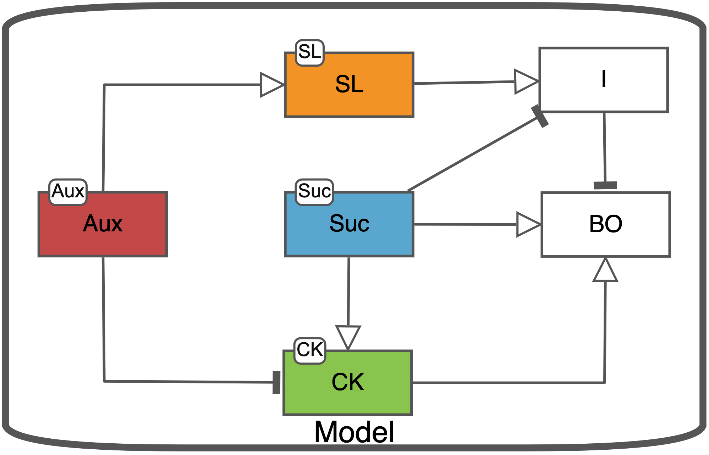
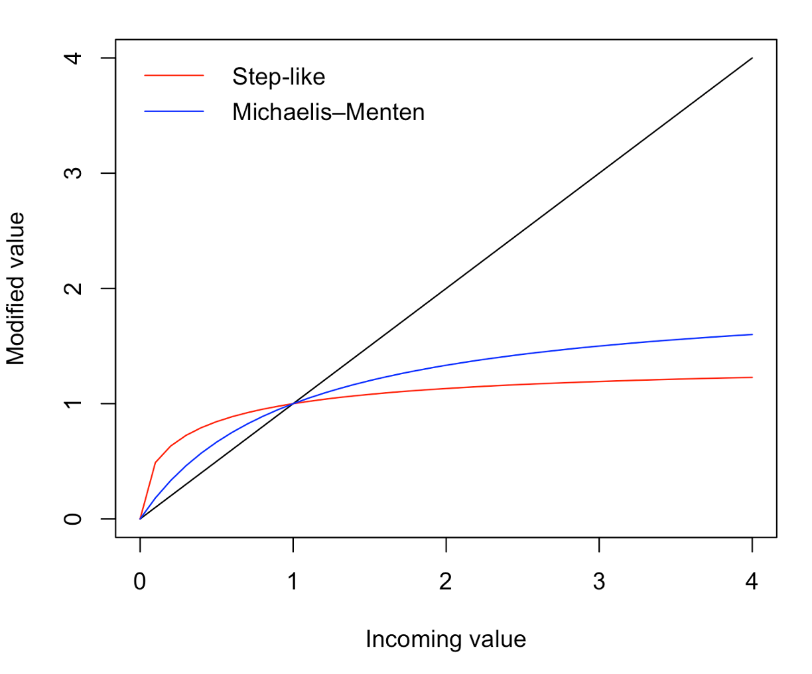

```{r, include = FALSE}
knitr::opts_chunk$set(
  collapse = TRUE,
  comment = "#>"
)
```

### Default algorithmic rule set

There are several types of information that can contribute to the building of an equation. These types of information will be considered in a particular order to build an equation acording to the algorithmic rules. See the first Table for the different components that can contribute, as well as the order in which they are considered when building an equation. Equations do not necessarily need to include every one of these components. An example of how incoming edge types can be used to generate a difference equation can be seen in Figure 1.

Order of consideration | Equation building block | Representation in equation
-- | -- | ---
1	| Stimulant |	As an average of the summed stimulants 
2	| Inhibitor	| The number of inhibitors plus 1, divided by the sum of inhibitors plus 1
3	| Necessary stimulant	| A function of the necessary stimulant multiplied against the above influences
4	| Modifier | Multiplication against above influences

SBGN-AF syntax | Algorithmic rule
--- | -
{width=80%} | $B[t] = A[t-1]$
{width=80%} | $B[t] = \frac{2}{1 + A[t-1]}$
{width=80%} | $B[t] = 1*f(A[t-1])$
{width=80%} | $D[t] = \frac{2*A[t-1]}{1 + B[t-1]}*f(C[t-1])*d$

Here is an example of a diagram showing a simplified diagram of the branching network in plants.

```{r, echo=FALSE, out.width="80%", fig.cap="Figure 1. Simple branching network."}

```

Using the above algorithmic rules, this diagram would be translated into the following set of equations. 

$Aux[t] = Aux^{mod}$

$SL[t] = Aux[t-1] * SL^{mod}$

$Suc[t] = Suc^{mod}$

$CK[t] = Suc[t-1] * \frac{2}{1 + Aux[t-1]} * CK^{mod}$

$I[t] = SL[t-1] * \frac{2}{1 + Suc[t-1]}$

$BO[t] = \frac{CK[t-1] + Suc[t-1]}{2} * \frac{2}{1 + I[t-1]}$

The above example includes neither necessary stimulants, nor any exogenous supplies.

### Modifications to the functional forms of necessary stimulants

The influence of a necessary stimulant is defined by the user, which is applied as some function of the necessary stimulant (`f(necStim)`). The default function is simply linear. In this case, a necessary stimulant will behave in the same was as a modifier. Users can choose to instead use a form that is either step-like, or based on Michaelis-Menten dynamics.

```{r, echo=FALSE, out.width="80%", fig.cap="Figure 1. A depiction on how different forms for necessary stimulants can effect their downstream impact."}

```

Note that in all cases, when the value of the necessary stimulant is 1, the chosen form has no effect. Changing the functional form of a necessary stimulant has the greatest impact at low values for the necessary stimulant. The biological interpretation of the step-like functional form for example is that even a tiny supply of the necessary stimulant is required to induce a rapid response in the system.

Like a modifier, the necessary stimulant term will be multiplied against the other terms in the equations.

### Adding an exogenous supply 

One more term that can be added to equations is that of an exogenous supply. The exogenous supply term is the only one that does not have a direct representation in the SBGN diagram. Instead, you can indicate when you use the `buildModel` function if you want the equations to include an exogenous term by supplying the argument `exogenous = TRUE`. This is the default argument for the equation as it allows the most flexibility down the line. This argument can be changed to FALSE if you decide that you do not want to use an exogenous supply, and would rather have simpler looking equations.

The exogenous supply behaves as a static addition term in the equation. Whatever supply that you have chosen to provide, will be a final addition to the equation.
