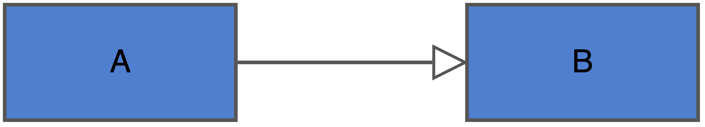
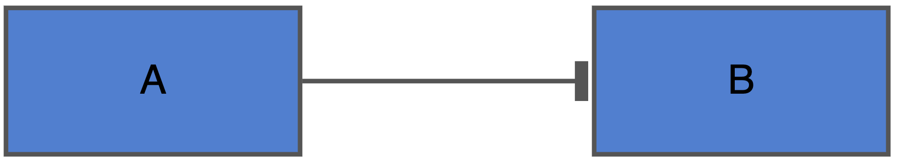
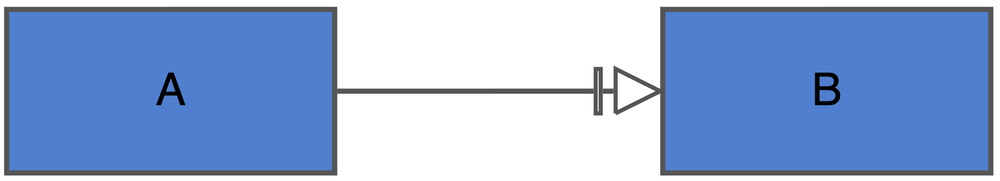
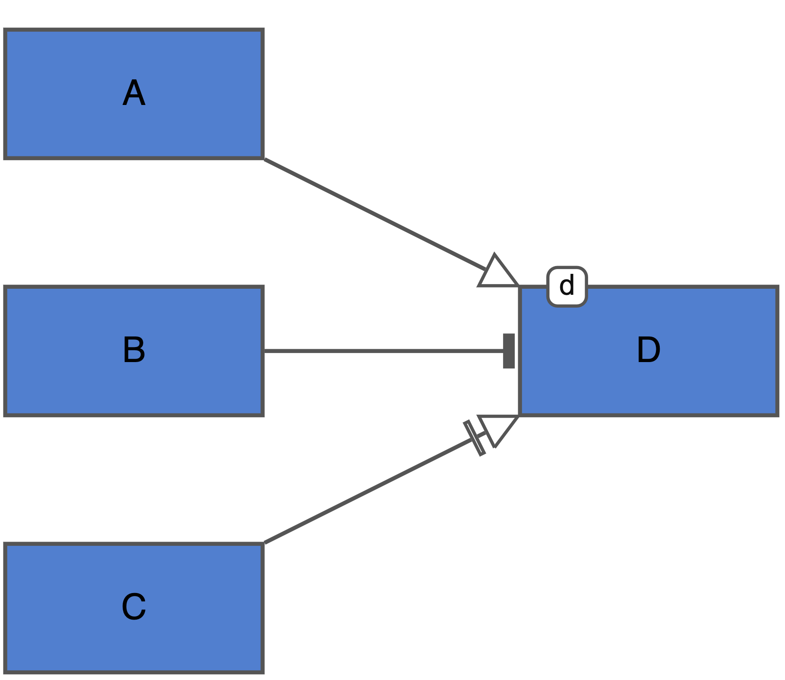

```{r, include = FALSE}
knitr::opts_chunk$set(
  collapse = TRUE,
  comment = "#>"
)
```

### Default algorithmic rule set

There are several ‘components’ that can contribute to the building of an equation. These components must be considered in a particular order to build a correct equation. See Table 3 for the different components that can contribute and the order in which they are considered when building an equation. Equations do not necessarily need to include every one of these components. An example of how incoming edge information can be used to generate a difference equation can be seen in Figure 1.

Order of consideration | Equation building block | Representation in equation
-- | -- | ---
1	| Stimulant |	As an average of the summed stimulants 
2	| Inhibitor	| 2 divided by the sum of one and the average of the inhibitors
3	| Necessary stimulant	| Multiplication against above influences
4	| Modifier | Multiplication against above influences

SBGN-AF syntax | Algorithmic rule
--- | -
{width=80%} | $B[t] = A[t-1]$
{width=80%} | $B[t] = \frac{2}{1 + A[t-1]}$
{width=80%} | $B[t] = 1*A[t-1]$
{width=80%} | $D[t] = \frac{2*A[t-1]}{1 + B[t-1]}*C[t-1]*d$


### Alternative algorithmic rules

### Modifications to the functional forms of necessary stimulants
