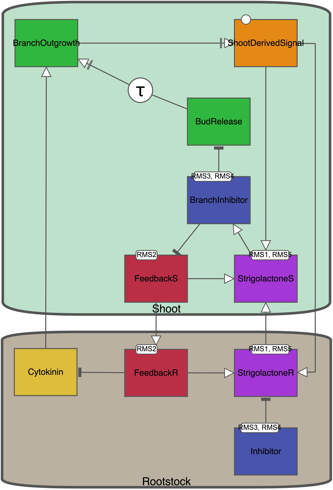
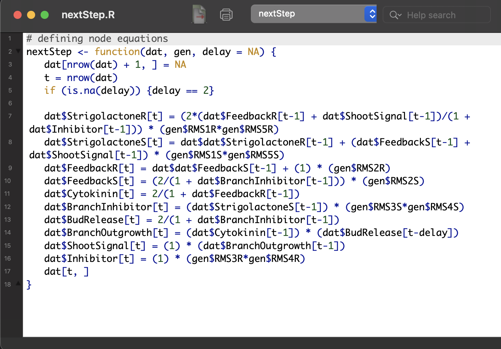

```{r setup, include = FALSE}
knitr::opts_chunk$set(
  collapse = TRUE,
  comment = "#>"
)
```

### Purpose and design philosophy of peaSoup

The peaSoup package was built as a tool to support the generation of network descriptions of biological systems. It is embedded in a larger workflow designed to ultimately assist in predicting the direction of change in a system in response to perturbations.

This workflow consists of several critical aspects: 

1. Describe the prior knowledge of the system as a series of statements.
2. Record the starting conditions and outcomes of experiments.
3. Translate statements into a diagram.
4. Convert the diagram into a computational model.
5. Test if the computational model recapitulates the statements. 

peaSoup has been designed to automate aspects 3, 4, and 5. Therefore, when generating models of a biological system, the user only needs to be actively involved with collating the existing knowledge of the system, and describing said system in a systematic way. Once a diagram has been produced, peaSoup will take over all operations. Therefore, peaSoup has a philosophy of standardizing how biological systems are described mathematically. 

In addition, peaSoup has the benefit of being completely transparent in how the model has been translated by explicitly giving the user access to the internal engine of the simulation (the `nextStep` function). In giving access to this internal engine, peaSoup gives the possibility for the user to manually change the mathematical description of the system.

### Walkthrough of how to use peaSoup

This is a short tutorial to demonstrate how you can use peaSoup to simulate network outcomes. Examples will use data that is included in this package.

First start by building a diagram of your network using some editor that can support SBGN diagrams of the Activity Flow language (I recommend [Newt Pathway Viewer & Editor](https://web.newteditor.org/)). This diagram will be based on a series of statements that have been constructed using the following rules (insert reference here).

```{r, echo=FALSE, out.width="50%", fig.cap="Figure 1. An example of a network diagram that can be produced using the Newt online editor."}

```

Once you are happy with your diagram, click `File` -> `Export` -> `SBGN-ML Plain`. This will generate a text file representation of your diagram using SBGN markdown language. You will then need to use the `convertSBGNdiagram` function to translate this text file into Network object that is easy to use.

```{r}
library(peaSoup)
PeaNetwork = convertSBGNdiagram("../data-raw/DunAFgenotype.sbgn", "PeaNetwork")
PeaNetwork
```

The above network object is available with the peaSoup package, and can therefore be called directly:

```{r}
peaNetwork
```

This Network object can then be passed to a function called 'buildModel' which will generate all
the information that is required to run a simulation of your network. You will need to provide a directory pathway for your model information to be stored in. If there already exists a folder of the specified name, this function will not overwrite the folder unless requested to do so (you would need to pass an additional argument `forceOverwrite = TRUE` to the buildModel function.)

```{r, eval=FALSE}
folder = "~/Desktop/Model"
buildModel(PeaNetwork, folder, dataFrame = TRUE)
```

To access the information, all you need to do is source the folder into the local environment:
```{r, echo=FALSE}
folder = "~/Desktop/Model"
```


```{r}
load(paste0(folder, "/genotypeDef.RData"))
load(paste0(folder, "/nodestartDef.RData"))
```

Within the folder that you have built, there will be three objects. Two of these objects will be data.frames specifying values to be fed to the model: one will give the genotypes and their wild type values, the second will give the starting node values for the simulation.

```{r, echo=FALSE}
holder = genotypeDef
genotypeDef = genotypeDef[1,]
```

```{r}
genotypeDef

nodestartDef
```

For these data.frames, each row can be considered as experimental condition that will need to be simulated. The data.frames are initially only a single row long, but the user can add any number of rows containing conditions that they wish to test (more on this later). These rows can be added manually, or they can be automatically generated using the purpose built functions: `genotypeScreen` and `randomStartScreen`.

In addition to these two data.frames, the folder you generate will also contain a script defining a function that is called `nextStep`. This function has been automatically generated from the PeaNetwork object based on the original diagram. 

```{r, echo=FALSE, out.width="80%", fig.cap="Figure 1. The nextStep function, which is automatically generated by the buildModel function."}

```

This function is what will be doing most of the work when running simulations of the network. This function is what calculates the node values at each step in time. It contains a series of difference equations which are the mathematical description of the information contained in the diagram.

This function has been provided as script accessible to the user in order to make sure that the automatic translation that has been done by the package is 100% transparent. In addition, it provides an opportunity for the user to modify the equations if they wish to do so. This is a potentially a dangerous thing to attempt as it is possible to introduce errors or bugs into the simulations. If the user decides to modify the code, they will be responsible for creating usable functions.

Once these three data objects have been created in our Model folder, the path directory of this folder can be provided as input to run simulations. If we want to run a single simulation, we can call the `simulateNetwork` function.

```{r}
simulation <- simulateNetwork(folder, tmax = 100) 
head(simulation)
```

```{r, out.width="80%", dpi=300}
# library(viridis)
# 
# quickPlot <- function(simulationData) {
#   par(mfrow = c(1, 2), mar = c(4,4,1,0))
#   plot.ts(simulationData, plot.type = "single", col = viridis(ncol(simulationData)),
#           ylab = "Expression")
#   plot.new( )
#   plot.window(ylim = c(0, 10), xlim = c(0, 10))
#   legend(0, 10, legend = colnames(simulationData), fill = viridis(ncol(simulationData)))
# }

quickPlot(simulation)
```

As the folder contains all of our genotype information, node starting values, as well as the script for the `nextStep` function, all the information to run the simulation is already there. The only thing left to specify is the length that we wish to simulate the network. Functionality will be provided so that the user can simulate until the system finds a stable state.

#### How to set up a simulation screen
It will often be the case that you do not wish to test a network only under a single condition. Sometimes there are a few specific conditions that you want to test, other times you want to conduct an exhaustive search. In either case, you will need to use the `setupSims` function, rather than the `simulateNetwork` function.

If there are a few specific conditions that you want to test, you can simply add rows to the respective data.frames. These rows will each be considered a unique starting condition for a simulation.

```{r}
genotypeDef[2:3, ] <- 1
genotypeDef[2, 3] <- 0
genotypeDef[3, 1:2] <- 0.5

genotypeDef
```
In the example above, the second row represents an 'experimental' condition where the function of RMS2 in the scion (shoot) has been knocked out. The third row represents a condition where the function of RMS1 has been reduced to half of its capacity in both the root, and the scion.

In the case that you want to do an exhaustive search, the `genotypeScreen` is useful for automating the construction of the appropriate data.frames.

```{r, echo=FALSE}
genotypeDef = holder
```

```{r}
genotypeScreen(folder)

load(paste0(folder, "/genotypeDef.RData"))
genotypeDef 
```

As you can see, the `genotypeScreen` function will generate a data.frame with combinations of up to however many mutations that you would like to explore. You can also specify the genotype expression values that you would like to use for your mutations. You can specify if you would like for the function to output an excel file in addition to the data. The excel file will be empty, but will have row and column names that correspond to the generated data.frame. This file can be filed with values that have been derived from the literature for the purpose of validating your model. You do not need to fill every value, as only the provided information will be used to validate the simulated data.

### Commentary on the collection of prior knowledge

### Algebraic Rules 

### Organising experimental outputs into bins

### Comparing experimental outputs to simulated outputs

### Recommended readings
